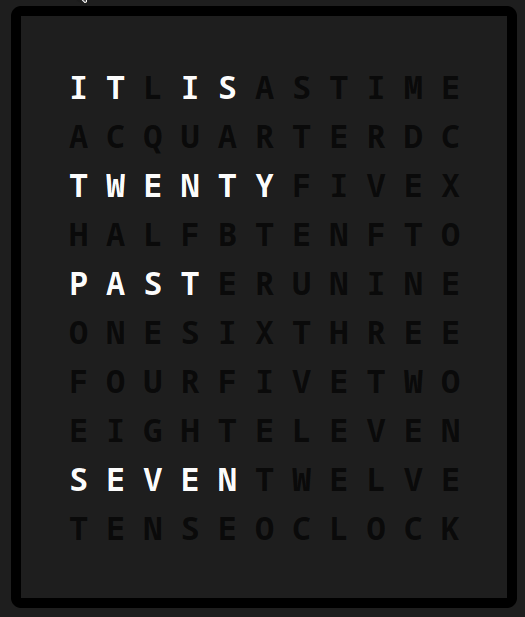

# word-clock (WIP)

## English layout

| 1 | 2 | 3 | 4 | 5 | 6   | 7 | 8 | 9 | 10 | 11 |
| --- | --- | --- | --- | --- | ----- | --- | --- | --- | ---- | ---- |
| I | T | L | I | S | A   | S | T | I | M  | E  |
| A | C | Q | U | A | R   | T | E | R | D  | C  |
| T | W | E | N | T | Y   | F | I | V | E  | X  |
| H | A | L | F | B | T   | E | N | F | T  | O  |
| P | A | S | T | E | R   | U | N | I | N  | E  |
| O | N | E | S | I | X   | T | H | R | E  | E  |
| F | O | U | R | F | I   | V | E | T | W  | O  |
| E | I | G | H | T | E   | L | E | V | E  | N  |
| S | E | V | E | N | T   | W | E | L | V  | E  |
| T | E | N | S | E | O’ | C | L | O | C  | K  |
